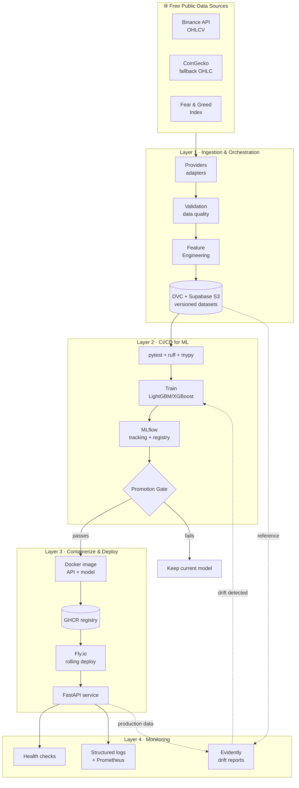

<div align="center">

# 🪙 AutoPredict-Pipeline

**An end-to-end, production-grade MLOps platform that autonomously ingests crypto market data, trains & gates models, ships a FastAPI service and monitors it for drift.**

Predicts the **4-hour price direction (UP / DOWN)** for **Bitcoin (BTC)** and **Solana (SOL)**.

[](../../actions/workflows/ci.yml)
[](../../actions/workflows/cd.yml)
[](https://www.python.org)
[](https://github.com/astral-sh/ruff)
[](http://mypy-lang.org/)
[](https://github.com/astral-sh/ruff)
[](LICENSE)

</div>

---

## 📌 Overview

Financial markets change every minute — which makes crypto direction forecasting a perfect stage to demonstrate **real MLOps**, not just a notebook. `AutoPredict-Pipeline` is built the way a mid/large tech company would run a model in production:

- **Fully automated** ingest → validate → feature-engineer → train → gate → deploy → monitor loop.
- **Clean Architecture** (ports & adapters) so business logic never depends on frameworks.
- **Automated promotion gate**: a new model reaches production *only* if it clears absolute thresholds **and** beats the incumbent.
- **Zero-downtime deploys** to Fly.io via a rolling strategy driven by CI/CD.
- **Continuous monitoring**: structured logs, Prometheus metrics and Evidently data-drift reports.

> This is a portfolio project designed to showcase the skill set of a **Machine Learning / MLOps Engineer**.

---

## 🧭 Table of Contents

1. [Architecture](#-architecture)
2. [MLOps Lifecycle](#-mlops-lifecycle)
3. [Tech Stack](#-tech-stack)
4. [Project Structure](#-project-structure)
5. [Getting Started](#-getting-started)
6. [Usage](#-usage)
7. [API](#-api)
8. [CI/CD](#-cicd)
9. [Data Versioning (DVC)](#-data-versioning-dvc)
10. [Monitoring & Observability](#-monitoring--observability)
11. [Testing & Quality](#-testing--quality)
12. [Roadmap](#-roadmap)

---

## 🏗 Architecture

The codebase follows **Clean Architecture**: dependencies point *inward*. The domain core (entities, enums, ports) knows nothing about pandas, FastAPI, MLflow or HTTP. Concrete adapters implement the ports and are wired together only at the composition root (`orchestration/`).



### The dependency rule

```
core (entities, ports)  ◄──  use-cases (collector, trainer, gate)  ◄──  adapters (binance, mlflow, fastapi)
        no deps                    depend on ports only                    depend on everything
```

---

## 🔁 MLOps Lifecycle

| Stage | What happens | Key modules |
|-------|--------------|-------------|
| **1. Ingest** | Pull OHLCV + sentiment, validate quality, persist raw Parquet | `ingestion/` |
| **2. Features** | 40+ technical indicators, leakage-safe 4h-ahead labelling | `features/` |
| **3. Train** | Chronological split, walk-forward CV, LightGBM/XGBoost | `training/` |
| **4. Evaluate** | ROC-AUC, accuracy, precision/recall/F1, log-loss | `evaluation/metrics.py` |
| **5. Gate** | Promote only if thresholds met **and** incumbent beaten | `evaluation/gate.py` |
| **6. Register** | Params, metrics, artifacts & model versions logged | `evaluation/mlflow_registry.py` |
| **7. Deploy** | Build image → push GHCR → rolling deploy to Fly.io | `docker/`, `.github/workflows/cd.yml` |
| **8. Monitor** | Health, latency, structured logs, Evidently drift | `monitoring/`, `api/middleware.py` |

---

## 🧰 Tech Stack

| Domain | Tools |
|--------|-------|
| **Language** | Python 3.11+ with full type hints |
| **Package/Env** | `uv` (fast, reproducible) |
| **ML** | scikit-learn, LightGBM, XGBoost, pandas, NumPy |
| **API** | FastAPI, Uvicorn, Pydantic v2 |
| **Tracking / Registry** | MLflow |
| **Orchestration** | Prefect |
| **Data Versioning** | DVC → Supabase Storage (S3-compatible) |
| **Monitoring** | Evidently AI, structlog, Prometheus |
| **Containers** | Docker (multi-stage), Docker Compose |
| **CI/CD** | GitHub Actions |
| **Deploy** | Fly.io + GitHub Container Registry |
| **Quality** | Ruff, mypy (strict), pytest, pre-commit |

---

## 📂 Project Structure

```
AutoPredict-Pipeline/
├── src/autopredict/
│   ├── core/            # domain: entities, enums, ports, exceptions (no deps)
│   ├── config/          # pydantic-settings + YAML loading
│   ├── ingestion/       # providers (Binance/CoinGecko/Fear&Greed), validation, repo
│   ├── features/        # technical indicators + feature/label pipeline
│   ├── training/        # estimator factory, time-split, trainer
│   ├── evaluation/      # metrics, promotion gate, MLflow registry adapter
│   ├── deployment/      # model store (joblib) + servable predictor
│   ├── monitoring/      # structured logging, Prometheus metrics, Evidently drift
│   ├── api/             # FastAPI app, routes, middleware, schemas, DI
│   ├── orchestration/   # composition root + Prefect flows
│   └── cli.py           # `autopredict` Typer CLI
├── tests/               # pytest unit suite (fakes for every port)
├── configs/             # versioned, non-secret config (YAML)
├── docker/              # Dockerfile + docker-compose (api + mlflow + minio)
├── .github/workflows/   # ci.yml, cd.yml, scheduled-retrain.yml
├── data/                # raw/processed/interim (DVC-tracked, git-ignored)
├── models/              # trained artifacts (DVC-tracked)
├── reports/             # Evidently HTML drift reports
├── docs/                # architecture & MLOps deep-dives
├── notebooks/           # exploratory analysis
├── fly.toml             # Fly.io deployment (rolling, zero-downtime)
└── pyproject.toml       # deps, ruff, mypy, pytest config
```

---

## 🚀 Getting Started

### Prerequisites
- Python 3.11+
- [`uv`](https://docs.astral.sh/uv/) (`pip install uv` or `curl -LsSf https://astral.sh/uv/install.sh | sh`)
- Docker (optional, for the full local stack)

### Install

```bash
git clone https://github.com/your-user/AutoPredict-Pipeline.git
cd AutoPredict-Pipeline

uv sync --all-extras --dev      # create venv + install everything
cp .env.example .env            # then fill in secrets

uv run pre-commit install       # enable git hooks
```

### Quick sanity check

```bash
make test        # run the test suite
make lint        # ruff + mypy
```

---

## 🎮 Usage

Every stage is a CLI command (also available via `make`):

```bash
uv run autopredict ingest           # 1. collect + validate + persist raw data
uv run autopredict build-features   # 2. engineer features & labels
uv run autopredict train            # 3. train, evaluate gate, promote winner
uv run autopredict drift-report     # 4. generate Evidently drift reports
uv run autopredict run-all          # the whole pipeline, in order
```

Run the API locally:

```bash
make api          # uvicorn on http://localhost:8000  (docs at /docs)
```

Spin up the **full local stack** (API + MLflow + MinIO):

```bash
make compose-up   # http://localhost:8000  |  MLflow http://localhost:5000
```

---

## 🌐 API

| Method | Path | Description |
|--------|------|-------------|
| `GET`  | `/health` | Liveness + which models are loaded |
| `GET`  | `/ready` | Readiness (degraded if no model) |
| `POST` | `/predict` | Predict 4h direction for an asset |
| `GET`  | `/metrics` | Prometheus metrics |
| `GET`  | `/docs` | Interactive OpenAPI docs |

**Example**

```bash
curl -X POST http://localhost:8000/predict \
  -H "Content-Type: application/json" \
  -d '{"asset": "BTC", "features": {"rsi": 55.3, "macd": 0.42, "...": 0.0}}'
```

```json
{
  "asset": "BTC",
  "direction": "UP",
  "probability_up": 0.63,
  "model_version": "20260706123000",
  "horizon_hours": 4,
  "created_at": "2026-07-06T12:30:00Z"
}
```

Every response carries an `x-request-id` (for log correlation) and `x-process-time-ms`.

---

## ⚙️ CI/CD

| Workflow | Trigger | Does |
|----------|---------|------|
| **ci.yml** | push / PR | ruff + `ruff format --check` + mypy + pytest (matrix 3.11/3.12) |
| **cd.yml** | push to `main` | reuse CI → `dvc pull models` → build & push image to **GHCR** → **rolling** deploy to Fly.io |
| **scheduled-retrain.yml** | cron `0 */4 * * *` | full pipeline → gate → `dvc push` → deploy **only if a model was promoted** |

The scheduler closes the loop: fresh data arrives, the model retrains, and production updates itself **only when the new model is provably better**.

---

## 🗃 Data Versioning (DVC)

Heavy files never touch git. `data/` and `models/` are tracked by **DVC** and pushed to **Supabase Storage** (S3-compatible).

```bash
dvc remote add -d supabase s3://autopredict/dvc
dvc remote modify supabase endpointurl https://<ref>.supabase.co/storage/v1/s3
dvc add data/raw models
dvc push          # upload to remote
dvc pull          # hydrate a fresh clone / CI runner
```

---

## 📈 Monitoring & Observability

- **Health checks** — `/health`, `/ready`, plus a Docker `HEALTHCHECK`.
- **Structured logging** — `structlog`, JSON in production, request-scoped correlation ids.
- **Metrics** — Prometheus counters/histograms for throughput, latency and prediction class balance.
- **Data drift** — `Evidently` compares the training reference against production features and writes HTML reports to `reports/`; a drift share above threshold can trigger a retrain.

---

## ✅ Testing & Quality

- **pytest** unit suite with in-memory fakes for every port (no network in tests).
- **Ruff** for linting + formatting; **mypy --strict** for typing.
- **pre-commit** runs all of the above before each commit.
- Coverage is reported in CI.

```bash
make test    # pytest --cov
make lint    # ruff + mypy
make format  # auto-fix
```

---

## 📊 Results

Numbers below come from a **real end-to-end run** against the live free APIs
(Binance + Fear & Greed), not synthetic data.

**Dataset** — 365 days of 1h candles per asset → **8,760 raw candles**, reduced to
**8,657 supervised samples × 34 engineered features** after indicator warm-up and
leakage-safe labelling. Model: LightGBM. Split: chronological 80/20 holdout with
5-fold walk-forward CV.

| Asset | Holdout ROC-AUC | Holdout Accuracy | Walk-forward CV AUC | Promotion gate |
|-------|:---------------:|:----------------:|:-------------------:|:--------------:|
| BTC   | 0.484 | 0.477 | 0.513 | ❌ **Rejected** |
| SOL   | 0.492 | 0.489 | 0.520 | ❌ **Rejected** |

> ### Why rejected is the right outcome
> Both models score around **AUC ≈ 0.5** — statistically indistinguishable from a
> coin flip. That is the *expected* result: short-horizon crypto direction is
> close to an efficient market, and these public features carry little edge.
>
> The point of this project is **not** to beat the market — it is to demonstrate a
> production MLOps system that behaves correctly. The **promotion gate did exactly
> its job**: it refused to ship a near-random model to production. A pipeline that
> promoted a 0.48-AUC model would be the real red flag. Beating the bar is a
> modelling problem (see the roadmap); **governing what reaches production is the
> engineering problem this repo solves.**
>
> To experiment, lower `promotion_gate.min_roc_auc` in `configs/config.yaml` and
> re-run `autopredict train` — the gate, registry and (local) model store will
> then persist and serve a candidate.

---

## 🗺 Roadmap

- [ ] Hyperparameter optimisation with Optuna, logged to MLflow.
- [ ] Order-book & on-chain features; Reddit/X sentiment via NLP.
- [ ] Backtesting harness with realistic PnL & transaction costs.
- [ ] Champion/challenger shadow deployment + automated rollback on drift.
- [ ] Feature store (Feast) and online feature serving.
- [ ] Grafana dashboards fed by the `/metrics` endpoint.
- [ ] Terraform for reproducible cloud infra.

---

## ⚠️ Disclaimer

This project is for **educational and portfolio purposes only**. It is **not financial advice** and must not be used to make real trading decisions.

## 📄 License

Released under the [MIT License](LICENSE).
